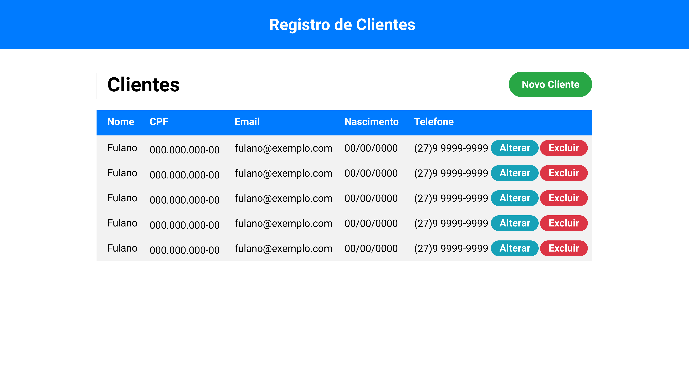
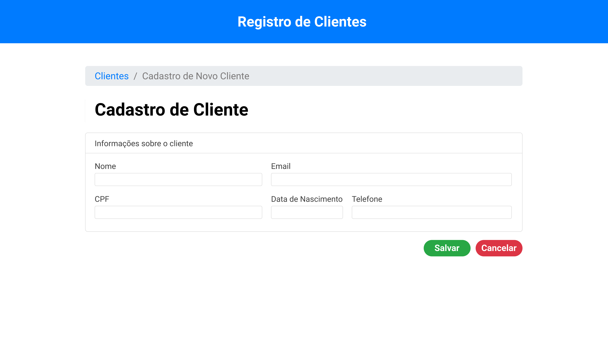
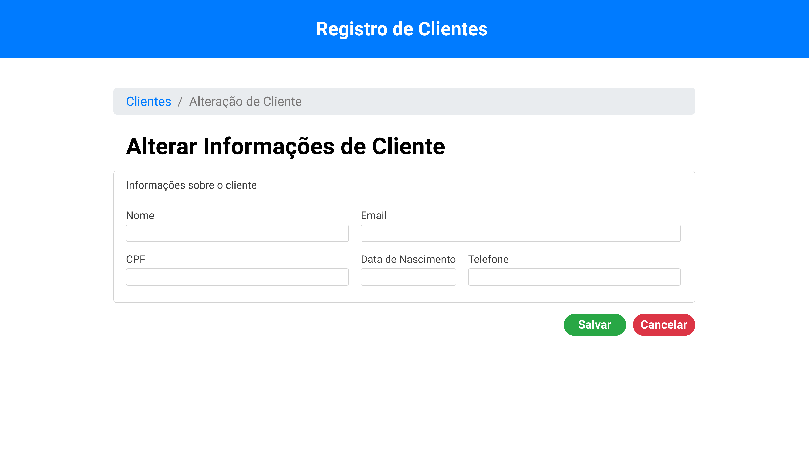

# Curso de Angular 10

Curso introdutório ao Angular, com a construção de uma aplicação CRUD e integração com API Rest

## Telas do Projeto

# Ementa do Curso

## 1. Introdução

-O que é o Angular e instalação do Angular CLI
    
-Configurando o editor de código (IDE)
    
-Apresentação do projeto do curso

## 2. Construção do Projeto

-Início do projeto com o Angular CLI e definição da estrutura inicial
    
-Instalando dependências (bootstrap)
    
-Criando módulo de clientes e definindo as rotas do projeto
    
-Criando a página de listagem de clientes
    
-Criando a página de novo cliente
    
-Criando a página de alteração de cliente
    
-Integrando o projeto com a API Rest
