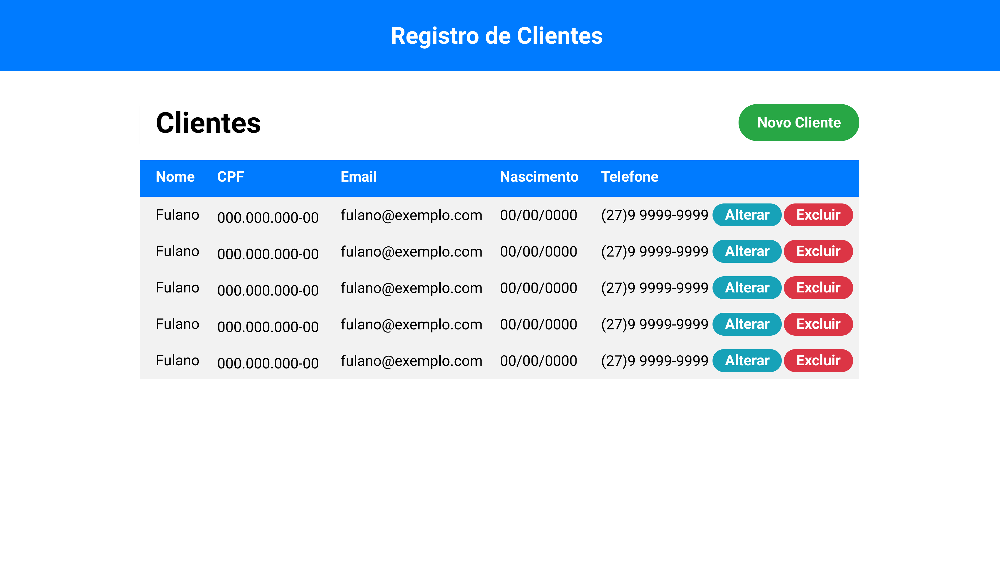
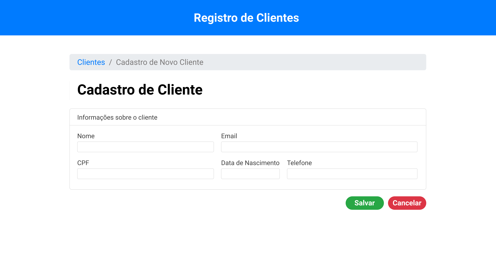
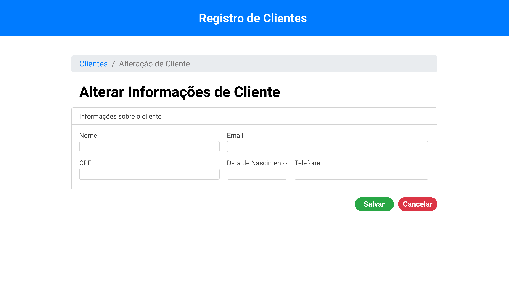

<h1 align="center">Curso introdutório ao Angular 10</h1>

  
   
  <i>Construção de uma aplicação CRUD e integração com uma API Rest</i>
   

  <a href="https://www.angular.io"><strong>Documentação Oficial do Angular</strong></a> 
  <a href="https://www.youtube.com"><strong>Link para as aulas</strong></a>
   

# Ementa do Curso

## 1. Introdução

    1.1. O que é o Angular e instalação do Angular CLI
    
    1.2. Configurando o editor de código (IDE)
    
    1.3. Apresentação do projeto do curso

## 2. Construção do Projeto

    2.1. Início do projeto com o Angular CLI e definição da estrutura inicial
    
    2.2. Instalando dependências (bootstrap)
    
    2.3. Criando módulo de clientes e definindo as rotas do projeto
    
    2.4. Criando a página de listagem de clientes
    
    2.5. Criando a página de novo cliente
    
    2.6. Criando a página de alteração de cliente
    
    2.7. Integrando o projeto com a API Rest

## Telas do Projeto

